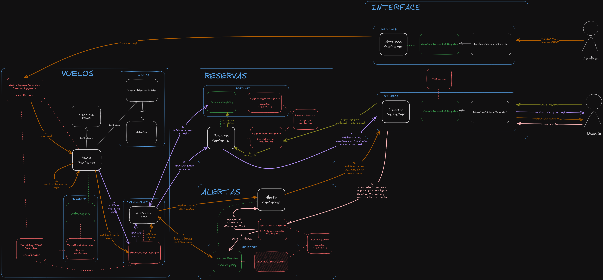

# LevantarVuelo - TP IASC 1C2023

## Introducción
__Enunciado__: https://drive.google.com/file/d/1z4H-VwM709zSUVZ5vj0ehP5XjaDDA_I9/view?usp=sharing

| Grupo #3  |
| -------------      |
| Nicolás Madeo      |
| Federico Larrea    |
| Nahuel Gil Peña    |
| Hugo Peykovich     |

## Levantar el TP
##### Requisitos
-   Elixir 1.14.5

##### Procedimientos
1. Ejecutar `mix deps.get` para instalar las dependencias
2. Ejecutar `iex -S mix`

## Diagrama de Arquitectura

> NOTA: en la carpeta __diagrams__ se encuentran el archivo .png de la arquitectura y algunos diagramas de secuencia de las interacciones más relevantes.
