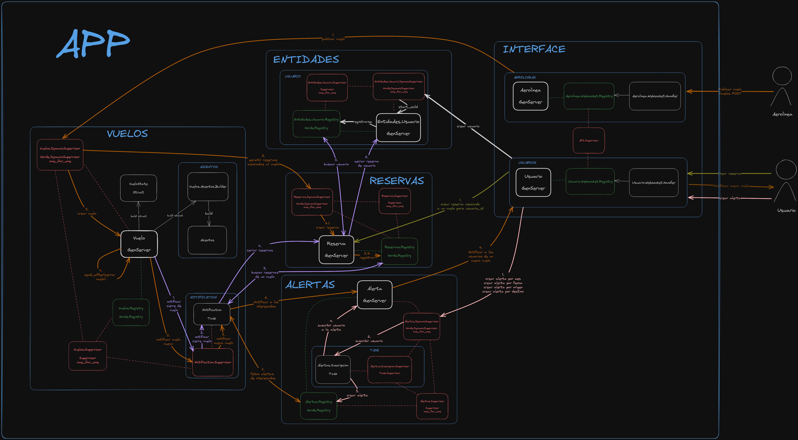

# LevantarVuelo - TP IASC 1C2023

## Introducción
__Enunciado__: [ver acá](./docs/%5BIASC%5D%20TP%201C%202023%20Arquitecturas%20concurrentes%20-%20IASC%20Levantar%20vuelo.pdf) o ir a la carpeta `docs`

| Grupo #3  |
| -------------      |
| Nicolás Madeo      |
| Federico Larrea    |
| Nahuel Gil Peña    |
| Hugo Peykovich     |

## Levantar el TP
##### Requisitos
-   Elixir 1.14.5

##### Pasos para levantar un nodo
1. Ejecutar `mix deps.get` para instalar las dependencias
2. Ejecutar `iex -S mix`

##### Pasos para levantar más de un nodo
1. Ejecutar `mix deps.get` para instalar las dependencias
2. `iex --sname nodo1 --cookie some_cookie -S mix`
3. `iex --sname nodo2 --cookie some_cookie -S mix`
4. `iex --sname nodo3 --cookie some_cookie -S mix`

## Diagrama de Arquitectura

> NOTA: también se encuentra el archivo __.excalidraw__ dentro de la carpeta `/docs/` para poder visualizar el diagrama con más detalle en https://excalidraw.com/

## Diagramas de secuencia
Se realizaron los diagramas de secuencia de las interacciones que consideramos más relevantes.

- ##### Publicación de un vuelo

- ##### Cierre de un vuelo

- ##### Inicio de reserva

- ##### Creación de alerta

